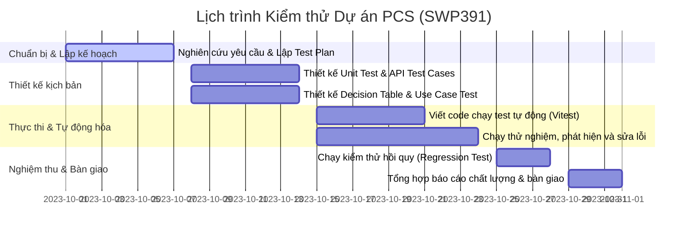

# KẾ HOẠCH KIỂM THỬ DỰ ÁN PCS (TEST PLAN) - MÔN SWP391

## 1. Giới thiệu (Introduction)

### 1.1 Mục đích tài liệu
Tài liệu này xác định kế hoạch và chiến lược kiểm thử cho hệ thống **Pickleball Court & Coach Booking System (PCS)** của nhóm môn **SWP391**. Mục tiêu là đảm bảo tất cả các chức năng cốt lõi của hệ thống hoạt động đúng đặc tả, ổn định và an toàn trước khi bàn giao cho người dùng cuối.

### 1.2 Tổng quan dự án
* **Tên dự án:** Pickleball Court & Coach Booking System (PCS).
* **Mô tả:** Hệ thống hỗ trợ người chơi đặt sân chơi pickleball trực tuyến, đăng ký học cùng huấn luyện viên (HLV), ghép cặp tìm đồng đội/đối thủ, hỗ trợ tư vấn bằng chatbot AI, và cung cấp trang quản trị (Admin) quản lý sân chơi cùng báo cáo doanh thu SaaS cho chủ sân.
* **Công nghệ phát triển:** Next.js (Backend & Frontend), MS SQL Server (Database).

---

## 2. Phạm vi kiểm thử (Scope of Testing)

### 2.1 Các chức năng được kiểm thử (Features to be Tested)
Hệ thống kiểm thử tập trung vào 11 module nghiệp vụ cốt lõi sau:
1. **User & Auth:** Đăng ký, xác thực mã OTP, đăng nhập JWT, kiểm tra trùng lặp email/SĐT.
2. **Court Management:** Xem danh sách sân, tra cứu slot trống theo ngày, quản trị sân (thêm/sửa).
3. **Booking Management:** Giữ chỗ slot sân trực tuyến, kiểm tra trùng lặp slot giờ, giới hạn tối đa 3 booking/ngày/user.
4. **Coach Management:** Đăng ký hồ sơ HLV, duyệt hồ sơ HLV (Admin), đặt lịch tập với HLV.
5. **Payment & Refund:** Tạo link thanh toán PayOS/Momo, webhook cập nhật hóa đơn, tính tỉ lệ hoàn tiền khi hủy lịch (100%/70%/0%).
6. **Promotion:** Áp dụng Voucher giảm giá, kiểm tra hạn dùng và giá trị đơn hàng tối thiểu.
7. **Review:** Đánh giá số sao (1-5) và bình luận cho sân đã trải nghiệm xong.
8. **Notification:** Ghi nhận và hiển thị thông báo in-app.
9. **Player Matching:** Gợi ý ghép cặp người chơi dựa trên vai trò tương thích và trình độ (skill gap).
10. **AI Assistant:** Tư vấn đặt sân thông qua chatbot Gemini, cơ chế tự động fallback khi cổng AI FastAPI mất kết nối.
11. **Admin Reports:** Thống kê doanh thu, số lượt đặt sân và so sánh chu kỳ tăng trưởng.

### 2.2 Các chức năng không được kiểm thử (Features not to be Tested)
* Tích hợp thanh toán thật với ngân hàng (chỉ kiểm thử ở môi trường Sandbox/Mock).
* Hiệu năng hệ thống dưới tải cực lớn (Load/Stress Testing - nằm ngoài phạm vi môn học SWP391).
* Bảo mật mức hạ tầng máy chủ và tường lửa.

---

## 3. Chiến lược kiểm thử (Testing Strategy)

### 3.1 Cấp độ kiểm thử (Testing Levels)
* **Unit Testing (Kiểm thử đơn vị):** Xác thực logic xử lý độc lập của các service (ví dụ: tính toán phần trăm hoàn tiền, tính điểm so khớp trình độ).
* **API Integration Testing (Kiểm thử tích hợp API):** Kiểm tra các endpoint HTTP `/api/*`, luồng dữ liệu giữa Route Handler và Database, quyền hạn Token JWT.
* **UI Component Testing (Kiểm thử giao diện):** Xác thực giao diện màn hình Đăng nhập (LoginPage) hiển thị chính xác và các lỗi nhập liệu được báo lên UI đúng quy tắc.

### 3.2 Phương pháp và Kỹ thuật kiểm thử
* **Black-box Testing (Kiểm thử hộp đen):**
  * **Phân vùng tương đương (Equivalence Partitioning):** Áp dụng cho các tham số đầu vào như tỉ lệ hoàn tiền, độ tuổi, định dạng email.
  * **Phân tích giá trị biên (Boundary Value Analysis):** Áp dụng kiểm thử các mốc giới hạn (ví dụ: mốc thời gian hủy lịch 2 giờ, 12 giờ; giới hạn đặt sân tối đa 3 lần/ngày).
  * **Bảng quyết định (Decision Table):** Kiểm thử tổ hợp các điều kiện trên Form Đăng ký tài khoản (họ tên, email, sđt, mật khẩu).
  * **Use Case Testing:** Kiểm thử kịch bản quy trình nghiệp vụ Đặt sân & Thanh toán trực tuyến (Basic flow & Alternative flows).
* **White-box Testing (Kiểm thử hộp trắng):**
  * Đạt độ bao phủ câu lệnh (Statement Coverage) >90% trên các file logic nghiệp vụ backend.
  * Đạt độ bao phủ quyết định/nhánh (Decision/Branch Coverage) >85%.

---

## 4. Tiêu chí Đạt/Không đạt (Pass/Fail Criteria)

### 4.1 Tiêu chí Đạt cho từng Ca kiểm thử (Test Case Pass Criteria)
* Kết quả thực tế (Actual Result) khớp hoàn toàn với kết quả mong đợi (Expected Result).
* Không xảy ra crash hệ thống ngoài ý muốn.

### 4.2 Tiêu chí Đạt cho toàn bộ hệ thống (System Release Criteria)
* 100% các ca kiểm thử tự động được thiết kế phải chạy thành công (Pass rate = 100%).
* Độ bao phủ mã nguồn (Code Coverage) của các thư viện nghiệp vụ cốt lõi đạt trên 90%.
* Không còn lỗi nghiêm trọng (Critical/High Severity) chưa được giải quyết.

---

## 5. Sản phẩm kiểm thử bàn giao (Test Deliverables)
* Kế hoạch kiểm thử (`TEST_PLAN.md`).
* Khung phân tích tính năng (`FEATURE_MATRIX.md`).
* Tài liệu thiết kế và kết quả kiểm thử đơn vị (`UNIT_TEST_REPORT.md`).
* Báo cáo kiểm thử Bảng quyết định (`DECISION_TABLE_TEST_REPORT.md`).
* Báo cáo kiểm thử Use Case (`USE_CASE_TEST_REPORT.md`).
* Hướng dẫn sử dụng công cụ kiểm thử (`TESTING_TOOLS_REPORT.md`).
* Báo cáo tổng hợp lỗi (`DEFECT_REPORT.md`) và báo cáo tổng kết chất lượng (`TEST_SUMMARY_REPORT.md`).

---

## 6. Môi trường kiểm thử (Environmental Needs)
* **Hệ điều hành:** Windows 10/11 hoặc macOS.
* **Môi trường chạy:** Node.js v18 trở lên.
* **Trình mô phỏng trình duyệt:** JSDOM (cho UI tests).
* **Thư viện chạy test:** Vitest v3.2.6, React Testing Library v16.2.0.
* **Hệ cơ sở dữ liệu:** Mocked SQL Server Connection.

---

## 7. Phân công nhân lực & Trách nhiệm (Staffing & Responsibilities)

Nhóm môn SWP391 gồm 5 thành viên tham gia hoạt động kiểm thử với vai trò cụ thể:

| STT | Thành viên | Vai trò kiểm thử | Trách nhiệm chính |
| :-: | --- | --- | --- |
| 1 | **LÊ THỊ VĂN ANH** | QA Leader | - Chủ trì thiết lập và chạy bộ công cụ kiểm thử (`TESTING_TOOLS_REPORT.md`). - Quản lý lỗi và kiểm duyệt báo cáo chất lượng (`TEST_SUMMARY_REPORT.md`, `DEFECT_REPORT.md`). |
| 2 | **TRƯƠNG QUANG TUÂN** | Tester 1 (Automation Tester) | - Thiết kế và thực thi bộ Unit Test tự động cho các service. - Viết báo cáo Unit Test (`UNIT_TEST_REPORT.md`). |
| 3 | **TRẦN QUỐC SANG** | Project Manager / Tester 2 | - Lập kế hoạch kiểm thử (`TEST_PLAN.md`). - Thiết kế kịch bản System Test dùng kỹ thuật Bảng quyết định (`DECISION_TABLE_TEST_REPORT.md`). - Đặc tả và chạy thử nghiệm Use Case (`USE_CASE_TEST_REPORT.md`). |
| 4 | **NGUYỄN ĐÀO VĂN QUÝ** | Developer 1 (Backend Dev) | - Hỗ trợ xây dựng các mock repository, API endpoints cho đội kiểm thử. - Sửa các lỗi phát sinh (Defects) liên quan đến API và logic nghiệp vụ. |
| 5 | **LÊ HỮU SƠN** | Developer 2 (Frontend Dev) | - Thiết kế giao diện UI biểu mẫu. - Hỗ trợ tích hợp React Testing Library để chạy UI Component test trên LoginPage. |

---

## 8. Lịch trình kiểm thử (Schedule)
Tổng thời hạn kiểm thử là **01 tháng (từ 01/10/2023 đến 01/11/2023)**, được chia chi tiết theo các giai đoạn tuần:

* **Tuần 1 (01/10 - 07/10):** Phân tích tài liệu yêu cầu nghiệp vụ hệ thống PCS. Lập và thống nhất kế hoạch kiểm thử tổng thể.
* **Tuần 2 (08/10 - 14/10):** Thiết kế chi tiết các ca kiểm thử. Lập bảng quyết định cho UI và viết đặc tả Use Case.
* **Tuần 3 (15/10 - 24/10):** Lập trình các kịch bản kiểm thử tự động trên Vitest. Thực hiện chạy thử nghiệm. Log lỗi vào hệ thống và phối hợp với các lập trình viên để vá lỗi.
* **Tuần 4 (25/10 - 01/11):** Chạy kiểm thử hồi quy toàn bộ hệ thống để đảm bảo không phát sinh lỗi mới. Xuất dữ liệu độ bao phủ code và viết báo cáo nghiệm thu chất lượng.

---

## 9. Rủi ro & Phương án dự phòng (Risks & Contingencies)
* **Rủi ro 1: Trễ tiến độ phát triển backend.**
  * *Phương án dự phòng:* Sử dụng mock dữ liệu và mock service trong thư mục `tests/mock` để viết trước kịch bản kiểm thử tự động, không cần đợi API thực tế hoàn thành.
* **Rủi ro 2: Flaky Tests (Kiểm thử chạy lúc đỗ lúc trượt do múi giờ hoặc biến môi trường).**
  * *Phương án dự phòng:* Đồng nhất múi giờ chạy test về múi giờ Việt Nam (UTC+7) bằng mã nguồn thiết lập cứng trong file cấu hình kiểm thử và làm sạch mock sau mỗi lần chạy test (`vi.clearAllMocks`).

---

## 10. Phê duyệt (Approvals)
* **QA Leader:** LÊ THỊ VĂN ANH (Đã ký duyệt)
* **Project Manager:** TRẦN QUỐC SANG (Đã ký duyệt)
* **Giảng viên hướng dẫn môn SWP391:** (Chờ phê duyệt)
